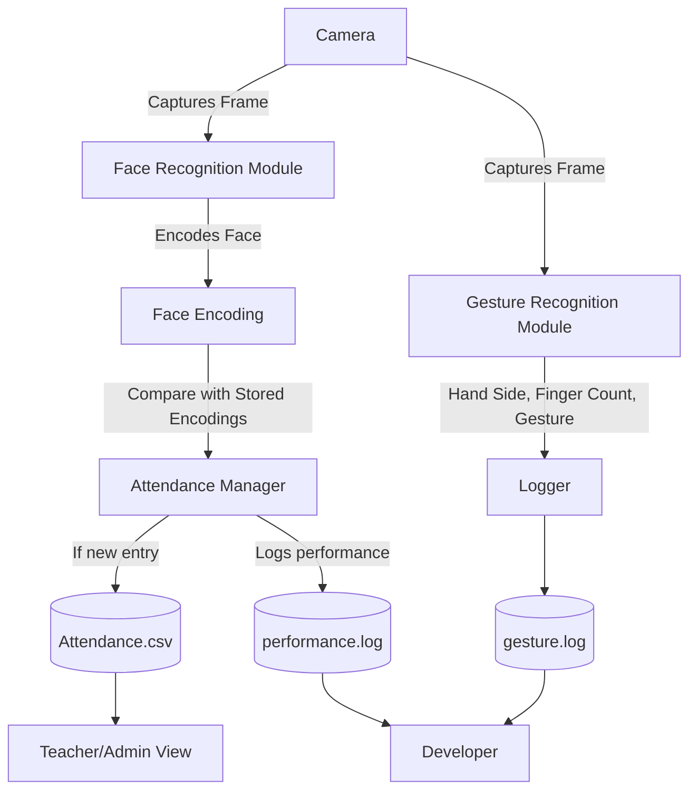

# Data Flow Diagram (DFD) – Extended for Gesture Recognition

```mermaid
flowchart TD
    Camera -->|Captures Frame| FaceRecognition[Face Recognition Module]
    Camera -->|Captures Frame| GestureRecognition[Gesture Recognition Module]

    FaceRecognition -->|Encodes Face| Encoder[Face Encoding]
    Encoder -->|Compare with Stored Encodings| AttendanceCheck[Attendance Manager]
    AttendanceCheck -->|If new entry| CSV[(Attendance.csv)]
    AttendanceCheck -->|Logs performance| LogFile[(performance.log)]

    GestureRecognition -->|Hand Side, Finger Count, Gesture| GestureLogger[Logger]
    GestureLogger --> GestureLogFile[(gesture.log)]

    CSV --> Teacher[Teacher/Admin View]
    LogFile --> Developer[Developer]
    GestureLogFile --> Developer[Developer]
```
